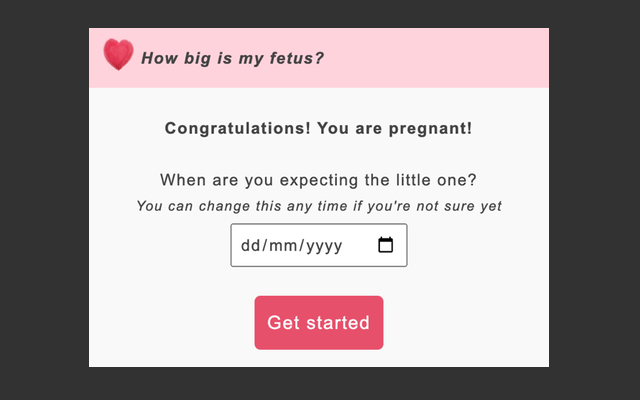
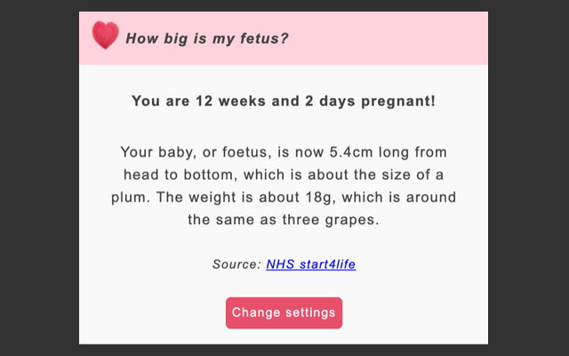

# Chrome extension to track the size of your baby when pregnant

Little plugin to quickly see the size and weight of your baby and what it is compared to a fruit or vegetable during pregnancy.

The extension also tells you exactly how long you're pregnant depending on your due date.
Don't worry if you don't know your exact due date yet. You can put down an estimate and change this date at any time.

Let your partner, friends or family join in the fun too! They can fill in your due date and see how your little one is doing as well.

Get the extension [here](https://chrome.google.com/webstore/detail/fetus-size/bpebginapdaoepffdbholoafcpdmdndh)!

